# HƯỚNG DẪN SỬ DỤNG TRANG QUẢN TRỊ WEBSITE DU LỊCH

Travel Admin

**BẢN NHÁP — CHƯA ĐỦ ẢNH/XÁC MINH**

Phiên bản tài liệu: 0.1 • Cập nhật: 20/09/2026

Phiên bản ứng dụng trên website: đang chờ đối chiếu với đơn vị quản trị.

Tài liệu dành cho nhân viên quản lý nội dung tour, điểm đến, dịch vụ và cấu hình website. Các hướng dẫn dưới đây đã được đối chiếu với mã nguồn; chưa được xác minh trên website đang hoạt động. Chưa có ảnh chụp ứng dụng. Không dùng bản nháp này làm biên bản nghiệm thu thao tác lưu hoặc xóa.

## Mục lục

Mục lục tự động được tạo từ các tiêu đề trong bản Word. Khi mở bằng Word, bấm chuột phải vào mục lục, chọn **Update Field** rồi **Update entire table**. Bản Markdown sử dụng các tiêu đề bên dưới để điều hướng.

## 1 Giới thiệu và phạm vi

Tài liệu hướng dẫn sử dụng **Tours**, **Điểm đến**, **Dịch vụ**, **Settings → Trang chủ** và **Settings → Chung**. Người dùng cần trình duyệt có kết nối Internet, đường dẫn quản trị và tài khoản do người phụ trách cấp. Không đưa thông tin đăng nhập vào tài liệu hoặc ảnh chụp.

Các tên “Tour mẫu Hà Giang 3 ngày”, “Điểm đến mẫu Hà Giang” và “Nhà nghỉ mẫu Bình Minh” trong tài liệu là ví dụ hư cấu, chưa được tạo trên hệ thống. Chúng chỉ giúp chuẩn bị nội dung; không phải dữ liệu kinh doanh thật.

**Phạm vi xác minh:** mọi quy trình trong bản này ở trạng thái **Đã kiểm tra mã nguồn, chưa xác minh trên trình duyệt**. Các kết quả mong đợi mô tả hành vi dự kiến, không phải kết quả thử nghiệm thực tế. Các bước tạo, sửa, tải tệp và xóa dành cho nhân viên được giao quyền thực hiện công việc; không phải chỉ dẫn cho người chụp ảnh thực hiện trên production. Đợt thu thập ảnh hiện tại chỉ được xem và chụp, không gửi biểu mẫu hoặc thay đổi dữ liệu.

Các nút có thể chỉ hiển thị biểu tượng. Tên in đậm trong hướng dẫn là nhãn trên giao diện, chú thích hoặc tên truy cập của nút. Khi cửa sổ biểu mẫu dài, cuộn bên trong biểu mẫu để tìm phần cần dùng.

## 2 Đăng nhập và làm quen giao diện

### 2.1 Đăng nhập

**Mục đích:** mở khu vực quản trị nội dung.

**Điều kiện:** có URL quản trị và tài khoản hợp lệ do người phụ trách cung cấp qua kênh an toàn.

1. Mở URL quản trị được cung cấp.
2. Nhập **Tên đăng nhập**.
3. Nhập **Mật khẩu**.
4. Bấm **Đăng nhập** và chờ trạng thái **Đang đăng nhập...** kết thúc.

**Kết quả mong đợi:** trang quản trị mở danh sách **Tours**. Nếu thông tin không đúng, biểu mẫu có tiêu đề **Đăng nhập thất bại** và thông báo **Tên đăng nhập hoặc mật khẩu không đúng.**

**Lưu ý:** nếu bị đưa về trang đăng nhập khi đang làm việc, kiểm tra lại quyền truy cập với người phụ trách. Chưa xác minh thời điểm hết phiên trên website. Chưa tìm thấy nút đăng xuất hoạt động trong giao diện đã kiểm tra; không giả định đóng tab sẽ kết thúc phiên đăng nhập.

**Hình minh họa S01:** trang đăng nhập với hai ô trống, không chứa thông tin đăng nhập.

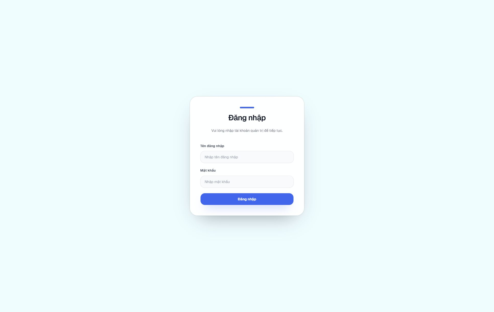

### 2.2 Điều hướng và tìm bản ghi

**Mục đích:** đến đúng khu vực và tìm nội dung cần quản lý.

1. Chọn **Tours**, **Điểm đến** hoặc **Dịch vụ** ở thanh bên.
2. Bấm **Settings** để mở hai nhóm **Trang chủ** và **Chung**.
3. Nhập từ khóa trong ô tìm kiếm của danh sách đang xem.
4. Chọn **Mỗi trang** để hiển thị 10, 20 hoặc 50 bản ghi.
5. Bấm **Trước** hoặc **Sau** để chuyển trang khi nút khả dụng.

**Kết quả mong đợi:** bảng hiển thị các bản ghi khớp từ khóa cùng số lượng và trang hiện tại. Xóa từ khóa khi cần xem lại toàn bộ danh sách.

**Lưu ý:** nút **Thu gọn sidebar** và **Mở rộng sidebar** thay đổi độ rộng thanh bên. Ở cửa sổ nhỏ, mở **Menu** để điều hướng. Bộ tìm kiếm Settings chỉ tìm trong nhóm đang xem. Không có hướng dẫn đặt chỗ, khách hàng hay bảng tổng quan vì chưa có các mục hoạt động tương ứng trong menu hiện tại.

**Hình minh họa S02:** thanh bên mở đầy đủ, gồm hai nhóm Settings.

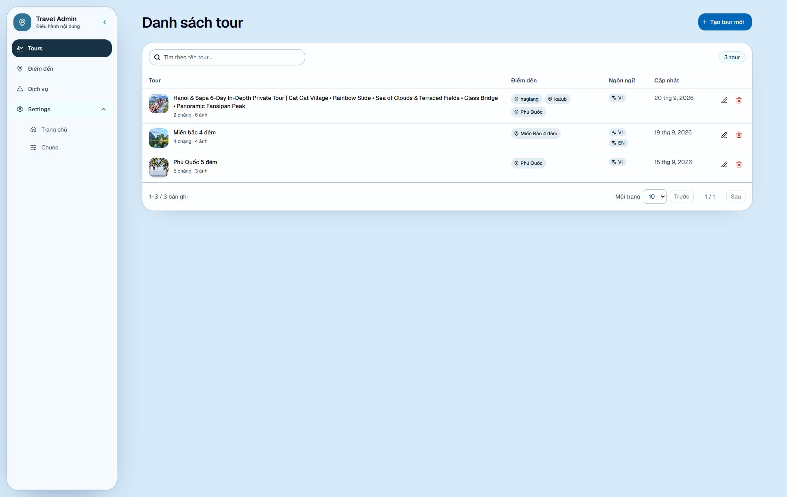

## 3 Quy trình làm việc đề xuất

Đây là trình tự khuyến nghị để giảm nhập lại nội dung, không phải điều kiện bắt buộc của hệ thống.

1. Chuẩn bị nội dung tiếng Việt, bản dịch tiếng Anh nếu có và các tệp được phép sử dụng.
2. Kiểm tra **Điểm đến**; tạo hoặc chỉnh sửa những điểm đến cần dùng.
3. Kiểm tra **Dịch vụ** và phân loại dịch vụ phù hợp.
4. Mở **Tours** để tạo tour hoặc chỉnh sửa tour đã có.
5. Hoàn thành **Thông tin**, **Kế hoạch tour** và **Dịch vụ**.
6. Kiểm tra bản dịch, ảnh bìa, ảnh từng chặng và các liên kết.
7. Lưu một lần sau khi ảnh xử lý xong.
8. Tìm lại và mở bản ghi để xác nhận nội dung thực sự được lưu.

**Lưu ý:** xem trước ảnh không đồng nghĩa với tải ảnh thành công; đóng biểu mẫu không thay thế thao tác lưu. Chưa có bằng chứng về lưu tự động, bản nháp xuất bản, hoàn tác sau lưu hoặc nút xem trước website công khai.

## 4 Quản lý điểm đến

### 4.1 Tìm và mở điểm đến

**Mục đích:** kiểm tra điểm đến trước khi tạo mới để tránh trùng nội dung.

1. Chọn **Điểm đến**.
2. Nhập từ khóa vào **Tìm theo tên, mô tả điểm đến...**.
3. Kiểm tra quốc gia và thông tin phường/xã của kết quả.
4. Bấm nút biểu tượng **Chỉnh sửa điểm đến** ở đúng dòng để xem biểu mẫu.

**Kết quả mong đợi:** mở **Chỉnh sửa điểm đến** với nội dung đã lưu. Dùng **Hủy** nếu chỉ xem.

**Lưu ý:** một điểm đến có thể dùng chung cho nhiều tour; thay đổi nội dung cần được cân nhắc với các tour đang liên kết.

**Hình minh họa S03:** danh sách, ô tìm kiếm, phân trang và các nút thao tác; dữ liệu bản ghi đã được che.

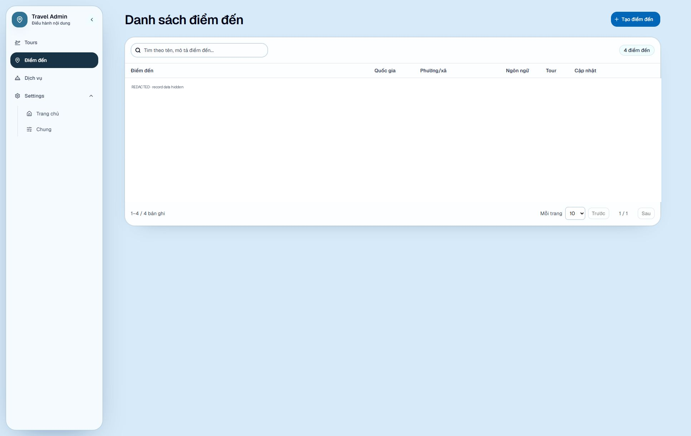

### 4.2 Tạo hoặc chỉnh sửa điểm đến

**Mục đích:** cung cấp điểm đến để chọn trong tour.

**Điều kiện:** đã chuẩn bị tên tiếng Việt và chọn đúng quốc gia.

1. Bấm **Tạo điểm đến** ở danh sách, hoặc mở **Chỉnh sửa điểm đến** của bản ghi có sẵn.
2. Chọn **Quốc gia**: **Lào**, **Cambodia** hoặc **Việt Nam**.
3. Ở **Tiếng Việt \***, nhập **Tên điểm đến (VI)** và mô tả nếu cần.
4. Chuyển sang **English** để bổ sung tên và mô tả tiếng Anh.
5. Nếu chọn Việt Nam, tìm trong **Tìm phường/xã** bằng ít nhất hai ký tự và chọn kết quả phù hợp. Có thể chọn nhiều phường/xã.
6. Kiểm tra toàn bộ thông tin rồi bấm **Tạo điểm đến** hoặc **Lưu thay đổi** ở cuối biểu mẫu.
7. Tìm lại điểm đến và mở để kiểm tra nội dung đã lưu.

| Tên trường | Ý nghĩa | Bắt buộc? | Ví dụ | Lưu ý |
| --- | --- | --- | --- | --- |
| Quốc gia | Quốc gia của điểm đến | Có | Việt Nam | Dùng chung cho các ngôn ngữ |
| Tên điểm đến (VI) | Tên tiếng Việt | Có | Điểm đến mẫu Hà Giang | Ít nhất 2 ký tự |
| Mô tả (VI) | Giới thiệu điểm đến | Không | Nội dung giới thiệu mẫu | Có thanh định dạng |
| Tên điểm đến (EN), Mô tả (EN) | Bản tiếng Anh | Không | Demo Ha Giang destination | Không tự dịch nội dung đã nhập |
| Phường/xã liên quan | Liên kết địa lý | Không | Chọn kết quả đúng thực tế | Chỉ áp dụng cho Việt Nam |

**Kết quả mong đợi:** biểu mẫu đóng và danh sách được làm mới; kiểm tra bằng cách mở lại bản ghi.

**Cảnh báo:** đổi quốc gia từ Việt Nam sang Lào hoặc Cambodia sẽ loại bỏ liên kết phường/xã khi lưu. Kiểm tra kỹ trước khi xác nhận. **Hủy** đóng biểu mẫu mà không gửi lưu; khi mở lại luôn kiểm tra giá trị, không xem nội dung còn hiển thị là bằng chứng đã lưu.

**Hình minh họa S04a:** biểu mẫu trống với quốc gia, nội dung tiếng Việt và vùng phường/xã.

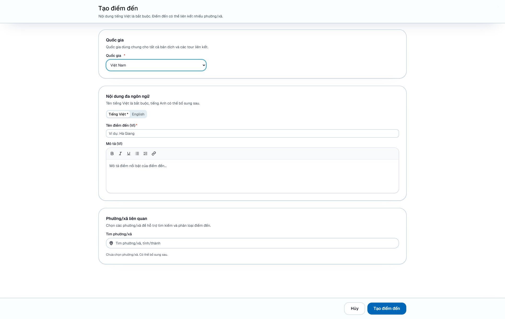

### 4.3 Xóa điểm đến

**Mục đích:** loại bỏ điểm đến không còn dùng, khi người phụ trách đã chấp thuận.

**Điều kiện:** điểm đến chưa được gắn với bất kỳ tour nào và đã được kiểm tra là không còn cần thiết.

1. Tìm đúng dòng trong **Điểm đến**.
2. Bấm **Xóa điểm đến**.
3. Đọc cảnh báo **Xóa điểm đến này?**; nếu không chắc chắn, bấm **Hủy**.
4. Chỉ khi được phép xóa, bấm **Xóa điểm đến** trong hộp xác nhận.
5. Kiểm tra danh sách để xác nhận bản ghi đã được loại bỏ.

**Kết quả mong đợi:** điểm đến cùng bản dịch và liên kết phường/xã bị xóa.

**Cảnh báo:** nút xóa bị khóa nếu điểm đến đang được gắn với tour. Không gỡ hàng loạt liên kết chỉ để vượt qua giới hạn này. Gỡ một điểm đến khỏi tour chỉ thay đổi liên kết của tour, không xóa điểm đến dùng chung.

**Hình minh họa S14b:** chờ ảnh hộp xác nhận hoặc nút bị khóa; không thực hiện xóa trong đợt chụp production.

## 5 Quản lý dịch vụ

### 5.1 Tìm và lọc dịch vụ

**Mục đích:** tìm dịch vụ đúng nhóm trước khi gắn vào tour.

1. Chọn **Dịch vụ**.
2. Nhập từ khóa vào **Tìm theo tên, mô tả dịch vụ...**.
3. Chọn một nhóm trong **Lọc theo phân loại dịch vụ**.
4. Chọn **Tất cả phân loại** hoặc bấm **Xóa bộ lọc phân loại dịch vụ** để bỏ lọc.
5. Bấm **Chỉnh sửa dịch vụ** tại dòng cần xem.

**Kết quả mong đợi:** danh sách phù hợp với từ khóa và phân loại. Có thể dùng **Mỗi trang**, **Trước**, **Sau** để xem các trang khác.

**Hình minh họa S05:** danh sách và bộ lọc phân loại; dữ liệu bản ghi đã được che.

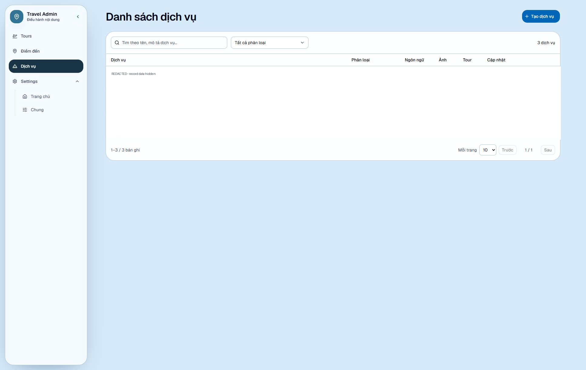

### 5.2 Tạo hoặc chỉnh sửa dịch vụ

**Mục đích:** chuẩn bị thông tin dịch vụ có thể tái sử dụng trong các tour.

1. Bấm **Tạo dịch vụ**, hoặc mở **Chỉnh sửa dịch vụ**.
2. Chọn **Phân loại dịch vụ \***.
3. Nhập **Tên dịch vụ (VI)** và **Mô tả (VI)** nếu cần.
4. Chọn **English** để nhập nội dung tiếng Anh.
5. Trong **Hình ảnh**, chọn các ảnh cần dùng theo thứ tự mong muốn và chờ tối ưu hoàn tất.
6. Bấm **Tạo dịch vụ** hoặc **Lưu thay đổi**.
7. Mở lại dịch vụ để kiểm tra phân loại, nội dung và ảnh.

| Tên trường | Ý nghĩa | Bắt buộc? | Ví dụ | Lưu ý |
| --- | --- | --- | --- | --- |
| Phân loại dịch vụ | Nhóm dịch vụ | Có | Nơi lưu trú và điểm dừng chân | Hai nhóm còn lại: Phương tiện di chuyển; Hướng dẫn viên |
| Tên dịch vụ (VI) | Tên tiếng Việt | Có | Nhà nghỉ mẫu Bình Minh | Ít nhất 2 ký tự |
| Mô tả (VI) | Nội dung giới thiệu | Không | Chỗ nghỉ mẫu dành cho đoàn tham quan | Nếu điền, ít nhất 10 ký tự nội dung |
| Tên dịch vụ (EN) | Tên tiếng Anh | Không | Demo Binh Minh guesthouse | Bổ sung theo nhu cầu |
| Mô tả (EN) | Nội dung tiếng Anh | Không | Demo accommodation for a tour group | Nếu điền, cũng ít nhất 10 ký tự |
| Hình ảnh | Ảnh của dịch vụ | Không | Ảnh được phép sử dụng | Ảnh đầu tiên là ảnh đại diện |

**Kết quả mong đợi:** biểu mẫu đóng, danh sách cập nhật và bản ghi mở lại chứa thông tin vừa lưu.

**Lưu ý:** ảnh dịch vụ hỗ trợ chọn, kéo thả hoặc paste. Chưa thấy nút riêng để đảo thứ tự ảnh; chuẩn bị thứ tự chọn từ đầu. Dịch vụ có thể được nhiều tour sử dụng. **Hủy** đóng biểu mẫu, không lưu thay đổi mới.

**Hình minh họa S06a:** biểu mẫu trống với phân loại, ngôn ngữ và vùng ảnh.

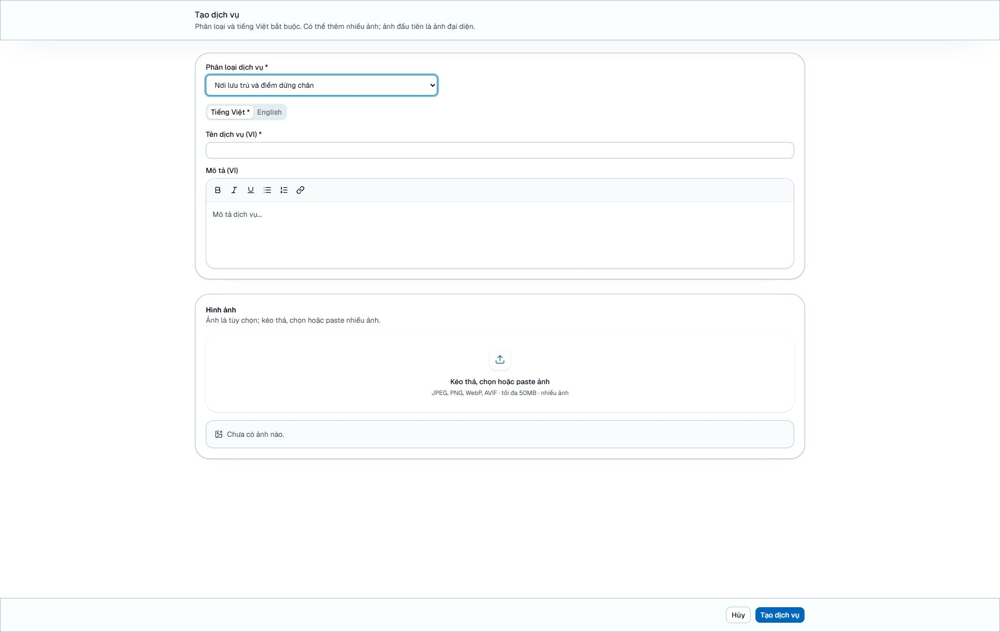

### 5.3 Xóa dịch vụ

**Mục đích:** loại bỏ dịch vụ không còn dùng.

**Điều kiện:** dịch vụ chưa liên kết với tour và việc xóa đã được người phụ trách chấp thuận.

1. Bấm **Xóa dịch vụ** ở đúng dòng.
2. Đọc **Xóa dịch vụ này?** và kiểm tra đúng đối tượng.
3. Chọn **Hủy** nếu chưa chắc chắn; chỉ chọn **Xóa dịch vụ** trong hộp thoại khi được phép thực hiện.
4. Kiểm tra lại danh sách.

**Kết quả mong đợi:** dịch vụ, bản dịch và ảnh liên quan bị xóa.

**Cảnh báo:** dịch vụ đang gắn với tour không thể xóa. **Gỡ dịch vụ** trong biểu mẫu tour chỉ gỡ liên kết khỏi tour đó sau khi lưu, không xóa dịch vụ khỏi danh mục.

**Hình minh họa S14c:** chờ ảnh cảnh báo xóa hoặc trạng thái bị khóa; không xác nhận xóa khi chụp.

## 6 Quản lý tour

### 6.1 Tìm và mở tour

**Mục đích:** tạo tour mới hoặc cập nhật đúng tour đã có.

1. Chọn **Tours**.
2. Nhập từ khóa vào ô tìm kiếm để lọc danh sách.
3. Dùng **Mỗi trang**, **Trước**, **Sau** khi cần.
4. Bấm **Tạo tour mới** để tạo mới, hoặc nút **Chỉnh sửa tour** ở dòng tương ứng.

**Kết quả mong đợi:** mở **Tạo tour mới** hoặc **Chỉnh sửa tour** với ba thẻ **Thông tin**, **Kế hoạch tour**, **Dịch vụ**.

**Hình minh họa S07:** danh sách Tours cùng nút tạo và thao tác từng dòng; dữ liệu bản ghi đã được che.

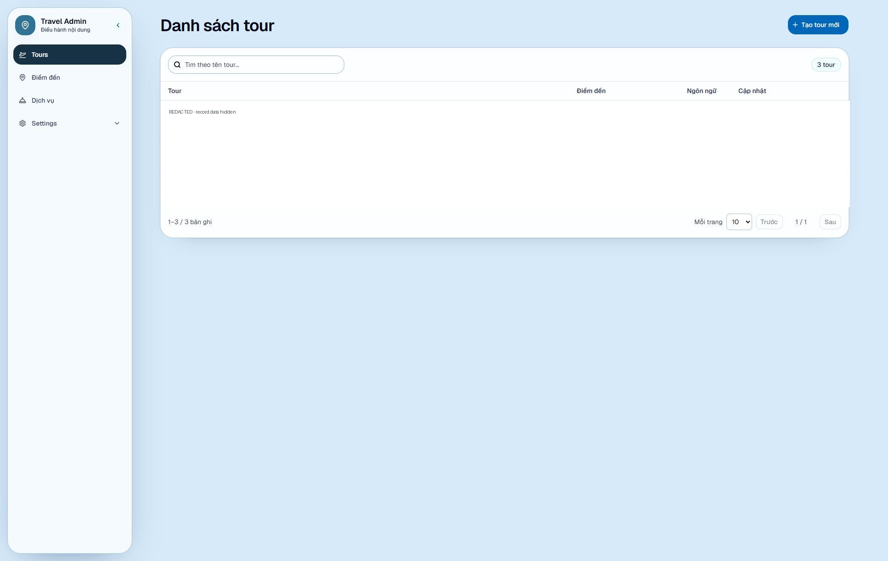

### 6.2 Nhập thông tin và bản dịch

**Mục đích:** xác định tên, nội dung giới thiệu và các quyền lợi của tour.

1. Mở thẻ **Thông tin**.
2. Chọn **Tháng bắt đầu khởi hành**, hoặc giữ **Chưa xác định**.
3. Ở **Tiếng Việt \***, nhập **Tên tour (VI)**.
4. Điền **Mô tả (VI)**, **Dịch vụ bao gồm (VI)** và **Dịch vụ không bao gồm (VI)** nếu có.
5. Chuyển sang **English** để bổ sung các nội dung tương ứng.

| Tên trường | Ý nghĩa | Bắt buộc? | Ví dụ | Lưu ý |
| --- | --- | --- | --- | --- |
| Tháng bắt đầu khởi hành | Tháng khởi hành chung | Không | Tháng 10 | Chỉ tháng 1–12, không phải ngày hoặc năm |
| Tên tour (VI) | Tên hiển thị tiếng Việt | Có | Tour mẫu Hà Giang 3 ngày | Ít nhất 2 ký tự |
| Mô tả (VI) | Điểm nổi bật của tour | Không | Khám phá cảnh quan và văn hóa địa phương | Nếu điền, ít nhất 10 ký tự nội dung |
| Dịch vụ bao gồm (VI) | Quyền lợi trong chương trình | Không | Bao gồm xe di chuyển theo lịch trình | Nếu điền, ít nhất 10 ký tự nội dung |
| Dịch vụ không bao gồm (VI) | Các khoản không nằm trong chương trình | Không | Không bao gồm chi tiêu cá nhân | Nếu điền, ít nhất 10 ký tự nội dung |
| Các trường (EN) | Nội dung tiếng Anh tương ứng | Không | Demo Ha Giang three day tour | Không tự dịch từ tiếng Việt |

**Kết quả mong đợi:** nội dung xuất hiện tại đúng thẻ ngôn ngữ, sẵn sàng để kiểm tra trước khi lưu toàn bộ tour.

**Lưu ý:** chữ “Tiếng Việt bắt buộc” không có nghĩa mọi ô tiếng Việt đều phải điền. Tên tour bắt buộc; các mô tả nêu trên có thể để trống. Tháng, điểm đến, dịch vụ, ảnh và mô tả dịch vụ chung không tách riêng theo thẻ English.

**Hình minh họa S08:** thẻ Thông tin bằng tiếng Việt, gồm các ô bao gồm/không bao gồm.

**Hình minh họa S09:** thẻ English của tour.

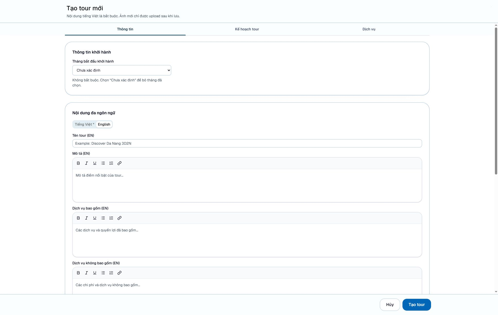

### 6.3 Gắn điểm đến

**Mục đích:** liên kết tour với những điểm đến đã có trong danh mục.

**Điều kiện:** các điểm đến cần chọn đã được tạo trong **Điểm đến**.

1. Tại thẻ **Thông tin**, cuộn đến **Điểm đến**.
2. Nhập ít nhất hai ký tự vào **Tìm điểm đến đã có, ví dụ: Hà Giang**.
3. Kiểm tra tên, quốc gia và phường/xã rồi chọn kết quả phù hợp.
4. Lặp lại để thêm các điểm đến khác nếu cần.
5. Nếu chọn nhầm, dùng nút **Xóa điểm đến** kèm số thứ tự tại mục đã gắn, rồi kiểm tra lại danh sách.

**Kết quả mong đợi:** các điểm đến xuất hiện trong biểu mẫu tour; liên kết chỉ được ghi nhận khi lưu tour.

**Lưu ý:** không có bước tạo điểm đến ngay trong bộ chọn. Một số dòng mô tả có nhắc “tạo” nhưng thao tác thực tế là tạo tại màn hình **Điểm đến**. Không rời tour chưa lưu để tạo điểm đến mà chưa chuẩn bị giữ lại nội dung.

**Hình minh họa S11a:** chờ ảnh bộ chọn và liên kết có sẵn, chỉ xem trong đợt chụp production.

### 6.4 Lập kế hoạch tour

**Mục đích:** trình bày nội dung từng chặng và ảnh tương ứng.

1. Chọn **Kế hoạch tour**.
2. Bấm **Thêm chặng**.
3. Nhập **Tên chặng (VI)** và **Mô tả chặng (VI)**.
4. Chuyển **English** của chính chặng đó để bổ sung tên và mô tả tiếng Anh.
5. Tại **Hình ảnh chặng**, chọn hoặc kéo thả ảnh dành riêng cho chặng, chờ xử lý hoàn tất.
6. Lặp lại **Thêm chặng** theo đúng trình tự lịch trình.
7. Kiểm tra các chặng trước khi lưu tour; dùng **Xóa chặng** kèm số thứ tự nếu cần bỏ một chặng.

| Tên trường | Ý nghĩa | Bắt buộc? | Ví dụ | Lưu ý |
| --- | --- | --- | --- | --- |
| Tên chặng (VI) | Tên từng chặng | Có khi thêm chặng | Ngày 1 Khởi hành | Phải có nội dung |
| Mô tả chặng (VI) | Hoạt động của chặng | Có khi thêm chặng | Đón đoàn và tham quan điểm đến mẫu | Nhập nội dung rõ nghĩa |
| Tên và mô tả chặng (EN) | Bản dịch từng chặng | Không | Day 1 Departure | Mỗi chặng có lựa chọn ngôn ngữ riêng |
| Hình ảnh chặng | Ảnh riêng cho chặng | Không | Ảnh phong cảnh được cấp phép | Không hỗ trợ paste tại vùng ảnh chặng |
| Tên ảnh | Mô tả ảnh dùng chung | Không | Toàn cảnh điểm tham quan | Nếu điền, 2–500 ký tự |

**Kết quả mong đợi:** các chặng hiển thị tuần tự trong biểu mẫu và được lưu cùng tour.

**Lưu ý:** có thể lưu tour không có chặng theo quy tắc hiện tại. Khi đã thêm chặng, phải điền nội dung tiếng Việt của chặng đó. Chưa thấy điều khiển kéo đổi thứ tự chặng hoạt động; không dùng biểu tượng tay nắm làm căn cứ rằng có thể kéo sắp xếp. Xóa chặng cũng loại ảnh của chặng khỏi bản chỉnh sửa; kiểm tra kỹ trước khi lưu.

**Hình minh họa S10:** thẻ Kế hoạch tour khi chưa có chặng; không thêm chặng để dàn dựng ảnh trên production.

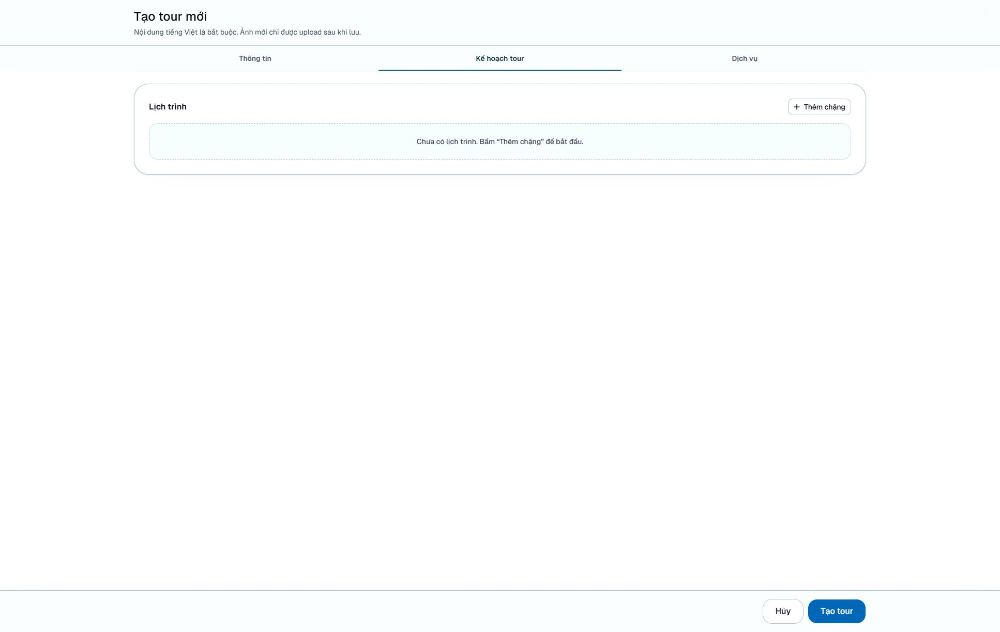

### 6.5 Chọn dịch vụ và viết mô tả chung

**Mục đích:** gắn các dịch vụ đúng phân loại và bổ sung nội dung riêng của tour.

**Điều kiện:** dịch vụ cần liên kết đã có trong danh mục **Dịch vụ**.

1. Mở thẻ **Dịch vụ** trong biểu mẫu tour.
2. Nhập **Mô tả dịch vụ chung** nếu cần.
3. Tại từng nhóm **Nơi lưu trú và điểm dừng chân**, **Phương tiện di chuyển**, **Hướng dẫn viên**, điền mô tả riêng của nhóm nếu có.
4. Nhập ít nhất hai ký tự vào **Tìm dịch vụ...** của nhóm tương ứng.
5. Chọn dịch vụ đúng từ kết quả; chỉ những dịch vụ thuộc nhóm đó được hiển thị.
6. Dùng **Gỡ dịch vụ** nếu đã chọn nhầm.

**Kết quả mong đợi:** dịch vụ được liệt kê trong đúng nhóm; nội dung chung và liên kết được ghi nhận khi lưu tour.

**Lưu ý:** các mô tả chung và mô tả theo nhóm không có bản riêng theo thẻ English. Chúng không bắt buộc nhưng nếu điền phải có ít nhất 10 ký tự nội dung. Gỡ liên kết không xóa dịch vụ dùng chung. Chưa thấy nút tạo dịch vụ trong bộ chọn hoặc nút sắp xếp dịch vụ.

**Hình minh họa S11b:** thẻ Dịch vụ, mô tả chung và các nhóm dịch vụ.

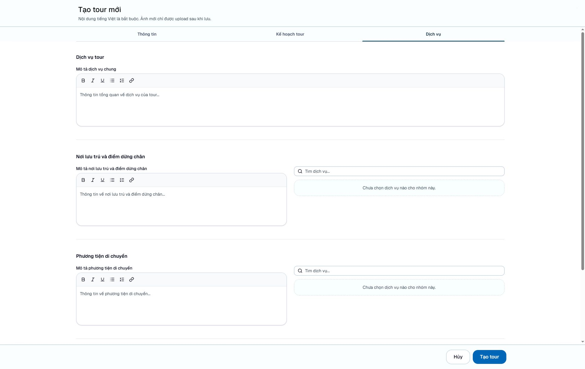

### 6.6 Chọn ảnh tour và ảnh bìa

**Mục đích:** bổ sung ảnh minh họa tour và xác định ảnh bìa.

1. Tại **Thông tin**, cuộn đến **Hình ảnh**.
2. Bấm **Kéo thả, chọn hoặc paste ảnh** để chọn tệp, hoặc kéo thả/paste ảnh vào giao diện hỗ trợ.
3. Chờ **Đang tối ưu ảnh...** kết thúc; kiểm tra ảnh xem trước.
4. Điền **Tên ảnh** nếu cần, từ 2 đến 500 ký tự khi có nhập.
5. Bấm **Đặt làm bìa** trên ảnh phù hợp và kiểm tra nhãn **Ảnh bìa**.
6. Kiểm tra ảnh còn lại trước khi lưu tour.

**Kết quả mong đợi:** chỉ một ảnh được chọn làm bìa; các ảnh khác là ảnh bổ sung. Tên ảnh dùng chung cho mọi ngôn ngữ.

**Lưu ý:** ảnh đầu tiên của bộ ảnh mới mặc định được chọn làm bìa khi chưa có ảnh. Sau khi bỏ ảnh bìa, kiểm tra và chọn lại ảnh bìa cần dùng. Không có nút riêng để đảo thứ tự ảnh trong giao diện đã kiểm tra. Chọn ảnh mới theo thứ tự mong muốn; ảnh đã có đứng trước ảnh mới trong danh sách gửi lưu.

**Hình minh họa S12:** chờ ảnh vùng Hình ảnh có các nhãn Ảnh bìa và Đặt làm bìa; không chọn tệp mới khi chụp production.

### 6.7 Lưu hoặc hủy tour

**Mục đích:** ghi nhận toàn bộ tour và kiểm tra kết quả.

1. Rà soát cả ba thẻ và các ngôn ngữ đã nhập.
2. Chờ tất cả ảnh tối ưu xong.
3. Bấm **Tạo tour** hoặc **Lưu thay đổi**.
4. Chờ **Đang lưu...** kết thúc. Nếu có lỗi, đọc thông báo và sửa đúng trường; biểu mẫu có thể chuyển đến vùng lỗi.
5. Khi trở lại danh sách, tìm và mở lại tour để kiểm tra nội dung, liên kết và ảnh.

**Kết quả mong đợi:** nội dung vẫn có khi mở lại tour. Việc bấm nút hoặc nhìn thấy ảnh xem trước không đủ chứng minh đã lưu.

**Cảnh báo:** **Hủy** hoặc đóng biểu mẫu loại bỏ bản chỉnh sửa tour chưa lưu. Không tải lại trang khi còn nội dung cần giữ. Nếu gặp lỗi mạng sau khi bấm lưu, kiểm tra danh sách trước khi gửi lại để tránh tạo trùng.

**Hình minh họa S13:** bị chặn trong phạm vi chụp chỉ đọc. Có thể chụp một bản ghi có sẵn đã được duyệt, nhưng phải ghi rõ đó không phải bằng chứng vừa lưu thành công.

### 6.8 Xóa tour

**Mục đích:** loại bỏ tour đã được xác nhận không còn sử dụng.

**Điều kiện:** có sự chấp thuận của người phụ trách nội dung và kiểm tra đúng tour.

1. Tại **Tours**, tìm đúng bản ghi.
2. Bấm **Xóa tour** của bản ghi đó.
3. Đọc cảnh báo trong hộp xác nhận; bấm **Hủy** nếu cần kiểm tra thêm.
4. Chỉ khi được phép, bấm **Xóa tour** trong hộp xác nhận.
5. Kiểm tra lại danh sách sau khi thao tác hoàn tất.

**Kết quả mong đợi:** tour không còn trong danh sách.

**Cảnh báo:** thao tác không thể hoàn tác theo cảnh báo giao diện. Không xóa tour để thử nghiệm hoặc tạo ảnh. Đừng nhầm xóa tour với gỡ một điểm đến/dịch vụ khỏi tour.

**Hình minh họa S14a:** chờ ảnh hộp xác nhận đã kiểm tra không có nội dung riêng tư; luôn bấm Hủy sau khi chụp.

## 7 Quản lý cấu hình

### 7.1 Tìm cấu hình đúng nhóm

**Mục đích:** xác định đúng cấu hình trước khi chỉnh sửa.

1. Mở **Settings → Trang chủ** hoặc **Settings → Chung**.
2. Nhập từ khóa vào **Tìm theo key, mô tả, giá trị trong nhóm...**.
3. Đối chiếu **Key**, mô tả và loại dữ liệu để nhận diện cấu hình.
4. Bấm **Chỉnh sửa setting** ở đúng dòng.

**Kết quả mong đợi:** mở biểu mẫu của cấu hình thuộc nhóm đang xem.

**Lưu ý:** nếu không tìm thấy, kiểm tra lại nhóm trước khi tạo mới. Nhãn **Không thể xóa** biểu thị cấu hình được bảo vệ khỏi xóa trong admin.

**Hình minh họa S15:** nhóm Trang chủ cùng các nút thao tác và nhãn bảo vệ; dữ liệu đã được che.

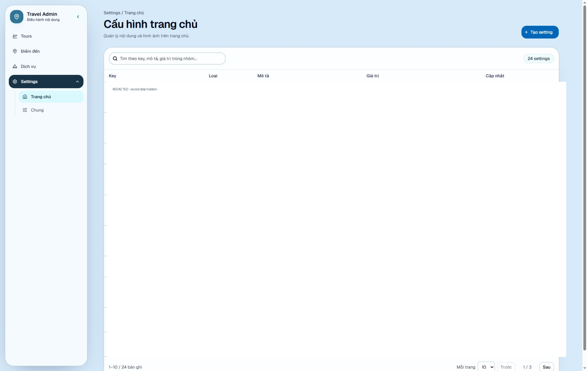

**Hình minh họa S16:** nhóm Chung cùng các nút thao tác và nhãn bảo vệ; dữ liệu đã được che.

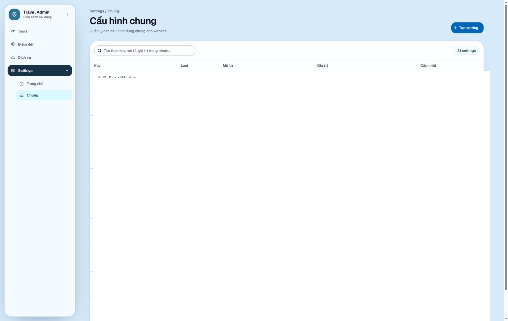

### 7.2 Sửa văn bản và nội dung có định dạng

**Mục đích:** cập nhật giá trị cấu hình đã được website sử dụng.

1. Mở **Chỉnh sửa setting** của cấu hình cần sửa.
2. Kiểm tra **Key** và **Loại**; hai trường này không đổi được sau khi tạo.
3. Nếu cần, cập nhật **Mô tả** để giải thích ý nghĩa của cấu hình.
4. Với **Text (trình soạn thảo)**, nhập **Nội dung tiếng Việt** bằng trình soạn thảo.
5. Với **Văn bản thuần (input)**, nhập giá trị tiếng Việt vào ô văn bản.
6. Chuyển thẻ tiếng Anh để nhập **English content** nếu cần.
7. Bấm **Lưu thay đổi**, sau đó mở lại để đối chiếu.

| Tên trường | Ý nghĩa | Bắt buộc? | Ví dụ | Lưu ý |
| --- | --- | --- | --- | --- |
| Key | Tên cấu hình mà website nhận biết | Có | Key do đội kỹ thuật chỉ định | Cố định sau khi tạo |
| Mô tả | Giải thích cấu hình | Không | Nội dung giới thiệu trang chủ | Không phải giá trị hiển thị thay thế |
| Loại | Cách nhập giá trị | Có | Text (trình soạn thảo) | Cố định sau khi tạo |
| Nội dung tiếng Việt | Giá trị văn bản tiếng Việt | Có với hai loại văn bản | Khám phá hành trình phù hợp với bạn | Phải có nội dung |
| English content | Giá trị tiếng Anh | Không | Find a journey that suits you | Giao diện thông báo dùng tiếng Việt nếu để trống |
| Ảnh hoặc Video | Giá trị tệp của cấu hình | Có với loại tương ứng | Tệp minh họa được cho phép | Một giá trị chung, không tách theo ngôn ngữ |

**Kết quả mong đợi:** nội dung được giữ lại khi mở lại cấu hình.

**Lưu ý:** quy tắc dùng tiếng Việt khi bỏ trống English được mô tả trong giao diện cấu hình; chưa kiểm chứng hiển thị trên website công khai. Không áp dụng quy tắc này cho mọi nội dung tour, điểm đến hay dịch vụ. Nhóm cấu hình cũng cố định sau khi tạo.

**Hình minh họa S17–S18:** chờ ảnh hai loại văn bản; chỉ dùng nội dung mẫu hoặc giá trị được duyệt công khai.

### 7.3 Thay ảnh hoặc video cấu hình

**Mục đích:** cập nhật tệp của một cấu hình đã có.

**Điều kiện:** xác định đúng cấu hình và có tệp được phép sử dụng.

1. Mở **Chỉnh sửa setting** của loại **Ảnh** hoặc **Video**.
2. Với ảnh, chọn ảnh mới trong vùng chọn ảnh và chờ tối ưu hoàn tất.
3. Với video, bấm **Chọn video** hoặc **Thay video** rồi chọn tệp MP4.
4. Kiểm tra phần xem trước đúng nội dung dự kiến.
5. Bấm **Lưu thay đổi**, chờ kết thúc rồi mở lại cấu hình để kiểm tra.

**Kết quả mong đợi:** cấu hình hiển thị tệp vừa lưu khi mở lại.

**Cảnh báo:** ảnh/video có thể ảnh hưởng vị trí đang hiển thị trên website. Chọn tệp mới chỉ tạo bản xem trước; tệp được tải khi lưu setting. Video không dùng quy trình tối ưu ảnh. Dùng **Hủy** nếu chưa muốn ghi nhận thay đổi.

**Hình minh họa S19a–S19b:** chờ ảnh riêng cho cấu hình ảnh và video; chỉ xem tệp sẵn có, không tải tệp mới trên production.

### 7.4 Tạo và xóa cấu hình dành cho người phụ trách

**Mục đích:** bổ sung hoặc loại bỏ cấu hình theo yêu cầu đã thống nhất với đội kỹ thuật.

**Điều kiện:** biết chính xác key, nhóm, loại dữ liệu, giá trị và ảnh hưởng dự kiến. Không tự đặt key để thử.

1. Để tạo, mở đúng nhóm và bấm **Tạo setting**.
2. Nhập **Key**, chọn **Loại**, nhập giá trị tương ứng.
3. Xác định lựa chọn **Cho phép xóa** theo yêu cầu; mặc định cấu hình mới không cho phép xóa.
4. Bấm **Tạo setting** rồi mở lại để kiểm tra.
5. Để xóa cấu hình được phép xóa, bấm **Xóa setting**, đọc cảnh báo, chỉ xác nhận khi đã được chấp thuận; nếu không, bấm **Hủy**.

**Kết quả mong đợi:** cấu hình xuất hiện hoặc được loại khỏi danh sách theo thao tác đã thực hiện.

**Cảnh báo:** key mới không tự tạo chức năng hay tự làm thay đổi website công khai. Key đã có không được trùng. Không thể đổi key, loại hoặc nhóm sau khi tạo. Cấu hình có nhãn **Không thể xóa** phải được giữ nguyên trong admin; liên hệ người phụ trách nếu cần xử lý, không tìm cách vượt qua bảo vệ.

**Hình minh họa S21:** chờ ảnh biểu mẫu tạo trống và lựa chọn Cho phép xóa; chỉ mở xem, không nhập hoặc lưu khi chụp production.

## 8 Soạn thảo nội dung và tải tệp

### 8.1 Định dạng nội dung

**Mục đích:** trình bày văn bản dễ đọc, nhất quán.

1. Nhập nội dung trong vùng soạn thảo của đúng ngôn ngữ.
2. Chọn đoạn cần định dạng rồi dùng **In đậm**, **In nghiêng** hoặc **Gạch chân**.
3. Dùng **Danh sách** hoặc **Danh sách số** cho nội dung liệt kê.
4. Để thêm liên kết, chọn đoạn chữ, bấm **Liên kết**, nhập địa chỉ vào **Nhập đường dẫn** rồi xác nhận.
5. Để bỏ liên kết, mở **Liên kết** tại đoạn đó và để trống địa chỉ khi xác nhận. Nếu đổi ý, hủy hộp nhập.
6. Kiểm tra lại nội dung trước khi lưu biểu mẫu chứa trình soạn thảo.

**Kết quả mong đợi:** định dạng xuất hiện trong nội dung; được lưu cùng bản ghi.

**Lưu ý:** thanh công cụ được kiểm tra có sáu chức năng trên, không có nút chèn ảnh. Dùng khu vực **Hình ảnh** riêng cho tệp ảnh. Không dán ảnh vào trình soạn thảo để thay thế thao tác chọn ảnh.

**Hình minh họa S22:** chờ ảnh thanh công cụ trên một vùng nội dung an toàn.

### 8.2 Hiểu các trạng thái tệp

| Trạng thái | Ý nghĩa | Việc cần làm |
| --- | --- | --- |
| Đang tối ưu ảnh | Trình duyệt đang xử lý tệp vừa chọn | Chờ hoàn tất; có thể bấm Hủy tối ưu nếu muốn dừng |
| Có ảnh/video xem trước | Tệp đã được chọn cho lần lưu này | Kiểm tra nội dung; chưa kết luận đã tải thành công |
| Đang lưu... | Hệ thống đang xử lý lưu bản ghi và tệp | Chờ kết quả, tránh bấm lưu nhiều lần |
| Mở lại thấy đúng nội dung | Có căn cứ kiểm tra dữ liệu đã lưu | Đối chiếu ảnh, tên, bản dịch và các liên kết |

**Giới hạn theo phiên bản mã nguồn đã kiểm tra:** ảnh JPEG, PNG, WebP, AVIF tối đa 50 MB mỗi tệp ở trình duyệt; ảnh vượt 100 triệu điểm ảnh bị từ chối. Ảnh được tối ưu trước khi gửi; vì vậy tệp sau xử lý có thể khác dung lượng và định dạng ban đầu. Hệ thống có kiểm tra tổng yêu cầu tải khoảng 500 MB, tính cả phần thông tin kèm theo, không phải 500 MB tệp thuần.

**Video:** phần Settings nhận MP4; giao diện ghi tối đa 50 MB. Giới hạn máy chủ cho ảnh/video có thể được cấu hình khác và chưa được xác minh trên website đang chạy. Nếu tệp nhỏ hơn mức trên vẫn bị từ chối, liên hệ người phụ trách; không coi các con số này là cam kết của môi trường production.

Ảnh tour, ảnh dịch vụ và ảnh setting hỗ trợ chọn, kéo thả hoặc paste tại khu vực phù hợp. Ảnh chặng chỉ hỗ trợ chọn hoặc kéo thả. Không có ảnh minh họa trạng thái xử lý vì đợt chụp chỉ đọc không chọn hay tải tệp.

## 9 Lỗi thường gặp và cách xử lý

Các thông báo dưới đây có căn cứ trong mã nguồn, chưa được kích hoạt thử trên production. Các bước xử lý là khuyến nghị an toàn.

| Biểu hiện | Nguyên nhân có thể | Cách xử lý an toàn | Khi cần hỗ trợ |
| --- | --- | --- | --- |
| Tên đăng nhập hoặc mật khẩu không đúng. | Thông tin không khớp | Kiểm tra bộ gõ, chữ hoa và tài khoản được cấp | Vẫn lỗi sau khi kiểm tra; không gửi mật khẩu qua ảnh |
| Tên tour/điểm đến/dịch vụ cần ít nhất 2 ký tự. | Tên tiếng Việt trống hoặc quá ngắn | Nhập tên có nghĩa ở đúng thẻ tiếng Việt | Nội dung hợp lệ vẫn bị từ chối |
| Mô tả cần ít nhất 10 ký tự. | Có nhập nhưng quá ngắn | Viết đủ nội dung hoặc để trống trường không bắt buộc | Không xác định được trường đang lỗi |
| Nội dung tiếng Việt là bắt buộc. | Thiếu nội dung chặng | Kiểm tra tên và mô tả của từng chặng | Đã điền đúng mà vẫn lỗi |
| Giá trị tiếng Việt là bắt buộc. | Cấu hình văn bản chưa có giá trị | Điền nội dung tiếng Việt có nghĩa | Không rõ cấu hình cần giá trị nào |
| Ảnh đang được tối ưu. | Xử lý ảnh chưa xong | Chờ hoặc Hủy tối ưu trước khi tiếp tục | Xử lý kéo dài bất thường |
| Chỉ hỗ trợ ảnh JPEG, PNG, WebP, AVIF. | Tệp không đúng định dạng | Chọn bản ảnh đúng định dạng, không chỉ đổi đuôi tên | Ảnh hợp lệ vẫn không đọc được |
| Mỗi ảnh không được vượt quá 50 MB. | Ảnh quá lớn ở bước kiểm tra trình duyệt | Giảm dung lượng ảnh rồi chọn lại | Tệp nhỏ vẫn bị từ chối |
| Tổng dung lượng tải lên không được vượt quá 500 MB. | Tổng tệp và dữ liệu kèm theo quá lớn | Giảm dung lượng hoặc chia lần cập nhật theo công việc được phép | Không xác định được giới hạn thực tế |
| Vui lòng chọn video MP4 cho setting loại Video. | Chưa chọn video phù hợp | Chọn tệp MP4 hợp lệ | Có video nhưng lưu vẫn lỗi |
| Key này đã tồn tại. | Trùng key cấu hình | Tìm key trong các nhóm trước khi tạo | Cần thay đổi thiết kế cấu hình |
| Nút xóa điểm đến/dịch vụ bị khóa | Bản ghi đang gắn với tour | Giữ nguyên và trao đổi với người phụ trách | Cần đánh giá ảnh hưởng trước khi gỡ liên kết |
| Không thể xóa trên setting | Cấu hình được bảo vệ | Không tìm cách vượt qua bảo vệ | Có yêu cầu thay đổi cấu hình hệ thống |
| Không thể lưu. Vui lòng thử lại. | Kết nối hoặc xử lý phía hệ thống lỗi | Kiểm tra bản ghi đã lưu chưa trước khi gửi lại | Lỗi lặp lại; gửi mô tả và ảnh đã loại dữ liệu riêng tư |

**Hình minh họa S20:** chưa có ảnh lỗi. Không gửi biểu mẫu sai hoặc đăng nhập sai để tạo lỗi trên production trong phạm vi hiện tại.

## 10 Checklist trước khi kết thúc công việc

- Mở lại bản ghi và xác nhận nội dung đã lưu đúng.
- Kiểm tra tên tiếng Việt và những trường bắt buộc của từng chặng.
- Đọc lại bản tiếng Anh nếu đã nhập; không giả định có tự dịch.
- Kiểm tra tháng khởi hành và các quyền lợi bao gồm/không bao gồm.
- Kiểm tra quốc gia, phường/xã và những điểm đến gắn với tour.
- Kiểm tra dịch vụ đúng phân loại và mô tả chung phù hợp.
- Kiểm tra thứ tự chặng và ảnh đang hiển thị; chuẩn bị đúng thứ tự từ đầu khi không có nút sắp xếp.
- Kiểm tra ảnh bìa, ảnh đại diện dịch vụ và ảnh đúng từng chặng.
- Với Settings, kiểm tra đúng nhóm, key, loại và giá trị cần thay đổi.
- Không để ảnh chụp công việc chứa thông tin đăng nhập hoặc nội dung riêng tư.
- Kết thúc sử dụng theo quy định của đơn vị; không coi việc đóng tab là thao tác đăng xuất đã được xác minh.

Các ảnh S01–S22 và bằng chứng trình duyệt sẽ được bổ sung sau khi có URL, khả năng truy cập và màn hình an toàn để chụp. Quy trình lưu/xóa/tải tệp vẫn chưa được thử trên production theo giới hạn chỉ đọc.
