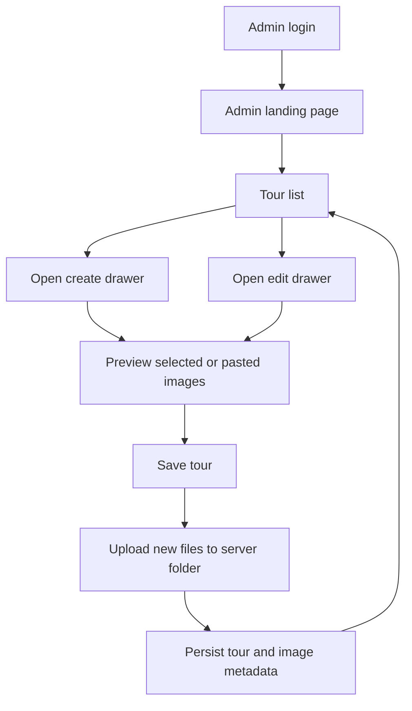
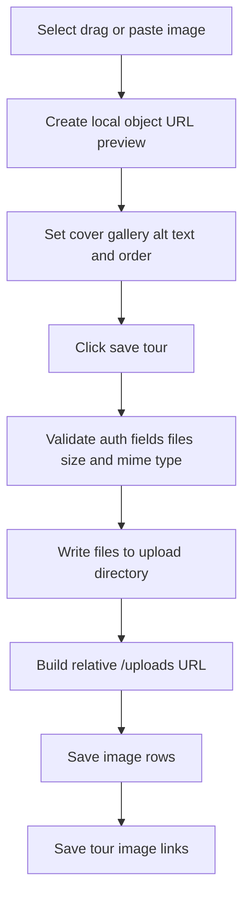

# Admin Tour CRUD, Upload, and Localization Plan

## 1. Current context

- Admin currently lands on [`src/app/admin/page.tsx`](../src/app/admin/page.tsx:10) after login.
- Protected access is handled by [`requireSession()`](../src/lib/auth/session.ts:113).
- Tour storage currently starts from [`tours`](../src/db/schema/tour-media.ts:23).
- Image metadata is stored in [`images`](../src/db/schema/tour-media.ts:61).
- Tour-image relationship is stored in [`tourImages`](../src/db/schema/tour-media.ts:90).
- Current tour domain snapshot is defined by [`TourSnapshot`](../src/domains/tour/domain/tour.ts:6).
- Current tour plan shape is defined by [`TourPlanProps`](../src/domains/tour/domain/tour-plan.ts:1).

## 2. Chosen UX direction

Use a single tour management screen instead of a dashboard.

### Flow



### Main screen

- [`src/app/admin/page.tsx`](../src/app/admin/page.tsx:10) should remain protected and then redirect to `/admin/tours`.
- `/admin/tours` should be the first actual admin screen.
- `/admin/tours` should show:
  - title and short description;
  - search input;
  - tour table;
  - create tour button;
  - row actions for edit and delete.

### Drawer pattern

- Creating and editing tour should happen in a right-side drawer, not a modal.
- Drawer is preferred because the form includes rich text fields, plans, and images.
- Drawer should be wide on desktop and full-screen or near full-screen on mobile.

## 3. Recommended UI libraries

### Table

- Use `@tanstack/react-table`.
- Reason: headless, works well with shadcn-style components and Tailwind, easy to add search, sorting, pagination, and custom row actions.

### Form and validation

- Use `react-hook-form`.
- Use `@hookform/resolvers`.
- Keep schema validation with [`zod`](../package.json:29).
- Reason: complex nested form with localized fields, plans repeater, and image metadata is easier to manage with form state.

### Rich text editor

- Use Tiptap packages:
  - `@tiptap/react`;
  - `@tiptap/starter-kit`;
  - `@tiptap/extension-link`;
  - `@tiptap/extension-placeholder`;
  - `@tiptap/extension-underline`.
- Use it for localized tour descriptions and localized tour plan descriptions.
- Persist content as sanitized HTML or a restricted rich-text JSON format.
- Recommendation for this project: persist sanitized HTML first for simpler rendering on the future client site.

### Drawer and confirmation dialog

- Use shadcn-style Drawer or Sheet primitives compatible with [`components.json`](../components.json:1).
- Use AlertDialog for destructive delete confirmation.

### Image upload UI

- Use `react-dropzone` for selecting and dragging files.
- Handle paste images manually with clipboard events.
- No upload should happen when selecting, dragging, or pasting an image.
- Upload should happen only when saving the tour.

## 4. Server-local upload strategy

### Goal

Admins can select image files from their machine or paste an image copied from another source. The browser should show a preview immediately. Files should only be uploaded to the Ubuntu server when the tour is saved.

### Server storage model

- Physical file path on Ubuntu: configured by `UPLOAD_DIR`.
- Public URL prefix stored in database: configured by `UPLOAD_PUBLIC_BASE_URL`.
- Recommended production values:
  - `UPLOAD_DIR=/var/www/uploads`
  - `UPLOAD_PUBLIC_BASE_URL=/uploads`

### Why `/uploads` exists

`/uploads` is the public URL prefix, not the physical directory. For example:

- Real file on server: `/var/www/uploads/tours/abc.jpg`
- URL stored in [`images.url`](../src/db/schema/tour-media.ts:65): `/uploads/tours/abc.jpg`
- Browser URL from admin domain: `https://admin.example.com/uploads/tours/abc.jpg`
- Browser URL from client domain: `https://client.example.com/uploads/tours/abc.jpg`

Both domains can point `/uploads` to the same physical directory through web server configuration.

### Multi-domain note

Store relative URLs like `/uploads/tours/abc.jpg` in [`images.url`](../src/db/schema/tour-media.ts:65), not hardcoded full domains. This lets an admin domain and a client domain serve the same upload folder without changing database records.

### Web server requirement

Next.js will not automatically serve files from `/var/www/uploads`. On Ubuntu, Nginx or another web server should map public `/uploads` to the physical `UPLOAD_DIR`.

Example deployment idea:

- Admin domain maps `/uploads` to `/var/www/uploads`.
- Client domain also maps `/uploads` to `/var/www/uploads`.

### Upload save flow



### Validation rules

- Only accept image MIME types such as JPEG, PNG, WebP, and AVIF.
- Reject oversized files using `MAX_UPLOAD_IMAGE_MB`.
- Generate safe file names on the server.
- Do not trust client-provided file names.
- Require auth before any server-side file write.
- If database save fails after file write, delete newly written files or record cleanup work.

## 5. Localization goals

The fields that should be localized first:

- tour name;
- tour description;
- tour plan name;
- tour plan description.

Non-localized fields should stay shared:

- tour ID;
- location latitude and longitude;
- images;
- image roles such as cover and gallery;
- sort order;
- created and updated timestamps.

## 6. Localization design options

### Option A: JSON localized fields inside existing table

Store name and description as JSON objects keyed by locale.

Example logical shape:

```json
{
  "vi": "Tour Đà Nẵng 3 ngày",
  "en": "Da Nang 3-day tour"
}
```

For tour plans, store localized name and description inside the existing JSONB plans array.

Pros:

- Simple data model.
- Fewer tables.
- Quick to implement.

Cons:

- Harder to query and index per locale.
- Harder to enforce validation with database constraints.
- Table list search by localized name is less clean.
- Migrating later to many locales or SEO slugs will be more painful.

### Option B: Translation tables for tours and embedded localized plan data

Keep core tour fields in [`tours`](../src/db/schema/tour-media.ts:23). Add a `tour_translations` table for localized tour text. Keep plans as JSONB, but each plan stores localized text.

Important clarification for Option B:

- Move tour-level `name` and `description` out of [`tours`](../src/db/schema/tour-media.ts:23) and into a new `tour_translations` table.
- Keep the `plans` JSONB column on [`tours`](../src/db/schema/tour-media.ts:31), but change each plan object so its `name` and `description` are localized maps instead of plain strings.
- Do not move plans into `tour_translations`. A `tour_translations` row represents one tour in one locale, not one plan.

Example Option B database shape:

```ts
tours: {
  id,
  latitude,
  longitude,
  plans,
  createdAt,
  updatedAt,
}

tour_translations: {
  tourId,
  locale,
  name,
  description,
  createdAt,
  updatedAt,
}

plans jsonb item: {
  sortOrder,
  name: { vi, en },
  description: { vi, en },
}
```

So Option B is a hybrid model: tour text is normalized, but plan text stays embedded in the tour row.

Suggested Option B domain shape:

```ts
type Locale = "vi" | "en";

type LocalizedText = Partial<Record<Locale, string>>;

type TourTranslationSnapshot = {
  locale: Locale;
  name: string;
  description?: string;
};

type TourPlanSnapshot = {
  sortOrder: number;
  name: LocalizedText;
  description: LocalizedText;
};

type TourSnapshot = {
  id: string;
  translations: TourTranslationSnapshot[];
  location?: TourLocationProps;
  plans: TourPlanSnapshot[];
  images: TourImageRefSnapshot[];
  createdAt: Date;
  updatedAt: Date;
};
```

Main domain method changes for Option B:

- [`Tour.create()`](../src/domains/tour/domain/tour.ts:37) should receive `translations` instead of a single `name` and `description`.
- [`Tour.rehydrate()`](../src/domains/tour/domain/tour.ts:52) should rebuild a tour from translation rows plus the shared tour row.
- [`Tour.rename()`](../src/domains/tour/domain/tour.ts:69) should become something like `upsertTranslation(locale, name, description)`.
- [`Tour.updateDescription()`](../src/domains/tour/domain/tour.ts:74) should be folded into the same translation update method.
- [`TourPlan.create()`](../src/domains/tour/domain/tour-plan.ts:16) should validate localized `name` and localized `description` maps instead of plain strings.
- [`TourPlan.toSnapshot()`](../src/domains/tour/domain/tour-plan.ts:39) should output localized maps.

Validation recommendation for Option B:

- Default locale `vi` must always have tour name.
- Default locale `vi` must always have each plan name and plan description.
- Secondary locale `en` can be optional and use fallback to `vi` on the client.
- If publishing workflow is added later, require all public locales before publish.

Why not put the whole `plans` array directly into `tour_translations`:

- A `tour_translations` row should represent the text of one tour in one locale, not the full child list of plan items.
- Plans are repeated child items with shared identity and ordering. If each locale row owns its own `plans` array, the same plan in Vietnamese and English no longer has one stable identity.
- Adding, deleting, or reordering a plan would require updating every locale row and keeping all arrays perfectly aligned.
- Locale rows can drift. For example, Vietnamese could have 5 plans while English has 4 plans, or plan order could become different by accident.
- It becomes harder to edit one plan consistently across locales because the system must match plan items by index or a manually embedded plan ID inside each locale JSON array.
- If a future plan item gets shared non-text fields such as duration, meal, transport, location, price note, or image, those fields would be duplicated in every locale row.

If the goal is to move `plans` out of [`tours`](../src/db/schema/tour-media.ts:23), the better design is not to put plans inside `tour_translations`, but to use Option C:

- `tour_plans` stores shared plan identity, tour ID, and sort order.
- `tour_plan_translations` stores localized plan name and description.

So there are two clean choices:

- Option B: keep plans embedded in [`tours.plans`](../src/db/schema/tour-media.ts:31), with localized name and description maps inside each plan.
- Option C: move plans into their own table and move plan localized text into a separate plan translation table.

Avoid putting the full plans array into `tour_translations` unless the product intentionally allows each language to have a completely different itinerary structure.

Pros:

- Cleaner tour-level translations.
- Better search and indexing for tour name per locale.
- Less migration work than fully normalizing everything.

Cons:

- Plan localization remains embedded in JSONB.
- Updating individual plan translations is still JSON-heavy.

### Option C: Fully normalized translation tables

Recommended long-term option.

Suggested tables:

- `tours`: shared tour data.
- `tour_translations`: localized tour name and description.
- `tour_plans`: shared plan identity and sort order.
- `tour_plan_translations`: localized plan name and description.
- `images`: shared image metadata.
- `tour_images`: shared image relationship.

Pros:

- Best long-term design.
- Easy search by locale.
- Easy validation per locale.
- Easier for SEO and future client site.
- Easier to show translation completion status in admin.

Cons:

- Requires schema changes and migration.
- More data access code.

## 7. Recommended localization approach

Use Option C if localization is a core requirement now.

Reason: the project is still early, so it is cheaper to normalize now than to build CRUD on the current non-localized shape and then migrate immediately afterward.

### Recommended locale model

Start with a finite locale list in code:

- `vi` as default locale;
- `en` as secondary locale.

Later, move locales to database only if business users need to manage them dynamically.

### Recommended schema shape

#### `tours`

Shared fields only:

- `id`;
- `latitude`;
- `longitude`;
- `createdAt`;
- `updatedAt`.

#### `tour_translations`

Localized fields:

- `tourId`;
- `locale`;
- `name`;
- `description`;
- `createdAt`;
- `updatedAt`.

Constraints:

- primary or unique key on `tourId` and `locale`;
- minimum trimmed name length;
- optional description but minimum length when present.

#### `tour_plans`

Shared plan fields:

- `id`;
- `tourId`;
- `sortOrder`;
- `createdAt`;
- `updatedAt`.

Constraints:

- unique key on `tourId` and `sortOrder`.

#### `tour_plan_translations`

Localized plan fields:

- `planId`;
- `locale`;
- `name`;
- `description`.

Constraints:

- primary or unique key on `planId` and `locale`;
- name required;
- description required or optional depending on business rule.

### Why not localize images first

Image `altText` may also need localization later, but it can wait. If SEO accessibility is important from the start, add `image_translations` with `imageId`, `locale`, and `altText`. Otherwise keep [`images.altText`](../src/db/schema/tour-media.ts:66) as a single default text for the first implementation.

## 8. Admin form design for localization

### Locale tabs

Use tabs in the drawer:

- Vietnamese tab;
- English tab.

Each tab includes:

- tour name;
- tour description editor;
- plan names;
- plan descriptions.

Shared fields remain outside locale tabs:

- coordinates;
- image upload;
- image role;
- image order.

### Translation completion indicators

In the drawer header or locale tabs, show completion status:

- default locale complete;
- English missing fields;
- plan translations missing.

### Validation recommendation

- Require default locale `vi` name.
- Require default locale `vi` plan names and descriptions.
- Allow secondary locale `en` to be partial during draft if the site supports fallback.
- If publishing is added later, require all public locales before publish.

### Frontend fallback rule

When rendering a tour in a requested locale:

1. Try requested locale.
2. Fallback to default locale `vi`.
3. If both missing, hide the tour or show a controlled placeholder in admin only.

## 9. CRUD implementation plan with localization

1. Add locale constants and helper functions for default locale and supported locales.
2. Update database schema to support normalized tour and plan translations.
3. Generate and apply database migration.
4. Update domain model so localized text is represented explicitly instead of a single name and description.
5. Update repository or data access functions to fetch tour rows with translations and images.
6. Update [`src/app/admin/page.tsx`](../src/app/admin/page.tsx:10) to redirect to `/admin/tours` after [`requireSession()`](../src/lib/auth/session.ts:113).
7. Create `/admin/tours` page with a localized display column for default locale.
8. Create table actions for edit and delete.
9. Create drawer form with shared fields and locale tabs.
10. Implement Tiptap editor for localized tour description and plan description.
11. Implement image preview manager for selected, dragged, and pasted images.
12. Implement save action that uploads pending image files only after validation succeeds.
13. Persist tour shared fields, tour translations, plans, plan translations, images, and tour image links in a transaction.
14. Implement update action that handles existing images, new image files, removed image links, and translation updates.
15. Implement delete action with confirmation dialog.
16. Revalidate `/admin/tours` after successful mutations.
17. Run lint and build checks.

## 10. Open decisions before implementation

- Confirm initial supported locales: recommended `vi` and `en`.
- Confirm whether English can be partial and fallback to Vietnamese.
- Confirm max image size for `MAX_UPLOAD_IMAGE_MB`.
- Confirm whether image alt text should be localized now or later.
- Confirm whether tour plan description is required for every locale or only required for default locale.

## 11. Recommended first implementation scope

Implement the localized schema first, then implement drawer CRUD against that schema.

This avoids building the CRUD twice and keeps the future client site ready for multiple domains and multiple languages.
